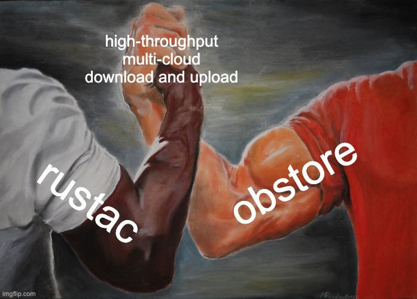

# rustac v0.8.0

[rustac](https://github.com/stac-utils/rustac-py) [v0.8.0](https://github.com/stac-utils/rustac-py/releases/tag/v0.8.0) includes **obstore** support.

**rustac** is a Python API and command-line interface for working with STAC.

## Agenda

- Demonstrate reading and writing with **rustac**, both to the local filesystem and with stores
- Inspect a **stac-geoparquet** file
- Demonstrate reading **stac-geoparquet** from a remote source
